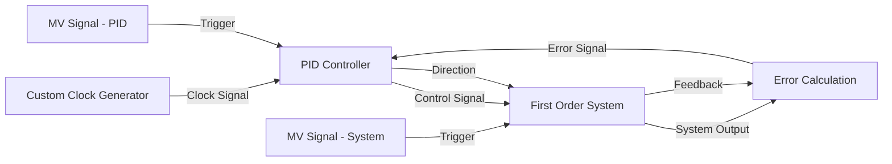
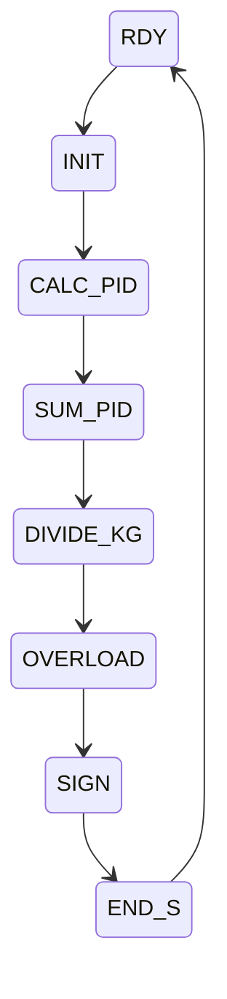
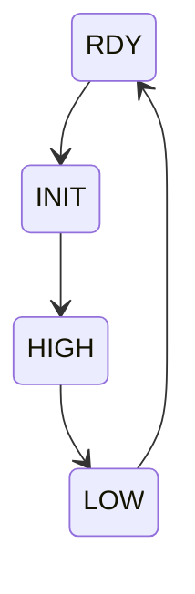
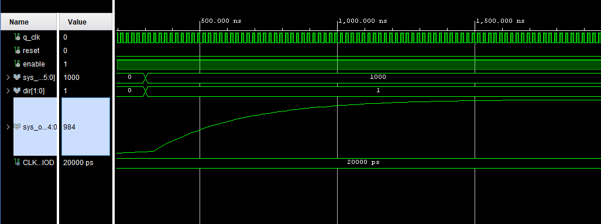

# Fordulatszám szabályozás PID megvalósításával

**Hallgató**: Babos Dávid

**Szak**: Számítástechnika, IV. év

**Tantárgy**: Újrakonfigurálható digitális áramkörök

**Projekt véglegesítésének időpontja**: 2024. 12. 17

| Feladat            | Pontszám |
| ------------------ | -------- |
| Jelenlét           | 10    	|
| Általános          | 10    	|
| Tervezés           | 10    	|
| Mérések            | 9     	|
| Dokumentáció össz. | 29    	|
| Tervezés           | 10    	|
| Implementálás      | 10    	|
| Szimuláció         | 10    	|
| Valós megvalósítás | 8     	|
| Valós rendszer     | 8     	|
| Projekt össz.      | 46       |
| Kérdések           | XX       |
| Összesen           | 85       |

# Projekt célja

A fordulatszám-szabályozás alapvető jelentőségű számos ipari és kutatási alkalmazásban, különösen olyan rendszerekben, ahol a precíz motorvezérlés elengedhetetlen. Ez a projekt egy PID szabályozó alapú FPGA implementációt valósít meg, amely a motor fordulatszámának valós idejű szabályozására szolgál. A rendszer fő moduljai: **PID szabályozó**, és **PWM generátor, elsőrendű rendszer, másodrendűrendű rendszer**. Továbbá, egy **VIO modul** biztosítja a kívánt fordulatszám dinamikus beállítását.

# Követelmények

## **Funkcionális követelmények**

1. **PID szabályozó modul**: Az enkódertől kapott aktuális fordulatszám alapján kiszámítja a szükséges vezérlő jelet (hibát, valamint a P, I, D komponenst).
2. **PWM jel generálása**: A PID modul által számított vezérlő jel alapján PWM jelet állít elő, amely szabályozza a motor sebességét.
3. **Elsőrendű rendszer:** a PID modul által számított értékre fog reagálni, parametrizálható módon fog úgy viselkedni, mint egy elsőrendű rendszer.
4. **Másodrendű rendszer:** a PID modul által számított értékre fog reagálni, parametrizálható módon fog úgy viselkedni, mint egy másodrendű rendszer.

## **Nem funkcionális követelmények**

- **Teljesítmény**: Az FPGA-n a PID számításnak valós idejű feldolgozásra alkalmasnak kell lennie.
- **Megbízhatóság**: A rendszer stabil működése kritikus.
- **Hatékonyság**: Minimális késleltetés a bemenet (Encoder) és a kimenet (PWM jel) között.

# Tervezés

1. **Fentről-le tervezés**: A rendszer fő funkcióit először nagy vonalakban lett megtervezve (PID, Encoder, PWM), majd részfeladatokra lettek bontva.
2. **Modularitás**: Minden modul külön VHDL fájlban található, amely könnyen újrahasznosítható és tesztelhető.

### Tömvázlat



### Magyarázat

1. **Clock (CLK):**
    - Egy órajel-generátor (Custom Clock Generator) biztosítja az időzítést a PID modul és az elsőrendű rendszer számára.
2. **PID Controller:**
    - A PID szabályozó a hibajel alapján kiszámítja a vezérlőjelet.
    - A kimeneti jel az elsőrendű rendszer bemeneteként szolgál.
3. **First Order System:**
    - Az elsőrendű rendszer megkapja a PID kimeneti jelét és generálja a rendszer kimenetét.
4. **Error Calculation:**
    - Az Error Module kiszámítja a hibajelet az elvárt és tényleges kimenet különbségeként, amely visszacsatolt bemenetként szolgál a PID számára.
5. **MV Signal:**
    - A PID és az elsőrendű rendszer mintavételezési jeleket kap a MV Signal modulokból.
6. **Feedback:**
    - A rendszer kimenete visszacsatolt bemenetként kerül az Error Module-hoz, amely továbbítja a hibát a PID szabályozóhoz.

# Architektúra

## Órajel-osztó

A bemeneti órajelet (`src_clk`) egy alacsonyabb frekvenciájú órajellé alakítja át a `div_val` bemeneti érték alapján.

**VHDL**:

```vhdl
library IEEE;
use IEEE.STD_LOGIC_1164.ALL;
use IEEE.std_logic_signed.ALL;

entity custom_clk is
    Port ( src_clk : in STD_LOGIC;
           reset : in std_logic;
           div_val : in STD_LOGIC_VECTOR (9 downto 0);
           q_clk : out STD_LOGIC);
end custom_clk;

architecture Behavioral of custom_clk is

begin

process(src_clk,reset)

variable x: integer range 1023 downto 0 := 0;
variable q: std_logic := '0';

begin 
if reset ='1' then
    x:=0;
    q:='0';
elsif src_clk'event and  src_clk='1' then
    if x<div_val then
        x:=x+1;
        q:=q;
    else
        x:=1;
        q:=not(q);
    end if;
end if;
q_clk<=q;
end process;

end Behavioral;
```

## Mintevételező modul

A modul egy mintavételező jelet generál, amely a bemeneti órajel frekvenciáján alapul, de az **`period`** paraméter által meghatározott intervallumonként egy **`'1'`** aktív impulzust állít elő.

**VHDL**:

```vhdl
library IEEE;
use IEEE.STD_LOGIC_1164.ALL;
use IEEE.std_logic_signed.ALL;

entity MV_signal is       
    port( q_clk : in std_logic;
          reset : in std_logic;
          period : in std_logic_vector(15 downto 0);
          out_signal : out std_logic
    );
end MV_signal;

architecture Behavioral of MV_signal is

begin

process(q_clk,reset)

variable x: integer range 65535 downto 0 := 0;
variable out_sig: std_logic :='0';

begin
if reset ='1' then
    x:=1;
    out_sig:='0';
elsif q_clk'event and  q_clk='1' then
    if out_sig='0' then 
        if x < period then
            x:=x+1;
        else
            out_sig := '1';
        end if;
    else
        out_sig := '0';
        x := 1;
    end if;
      
end if;

out_signal<= out_sig;

end process;
end Behavioral;
```

## Error modul

Ez a modul egy egyszerű aritmetikai műveletet végez: kiszámítja az **elvárt érték** és az **aktuális érték** közötti eltérést (**hibaérték**), és az eredményt 16 bites előjeles formátumban adja vissza.

**PID szabályozó modulban**: A referencia és aktuális fordulatszám közötti eltérés kiszámítása.

**VHDL**:

```vhdl
library IEEE;
use IEEE.STD_LOGIC_1164.ALL;
use IEEE.NUMERIC_STD.ALL;

entity error_m is
    Port ( exp_turn : in signed (14 downto 0);
           act_turn : in signed (14 downto 0);
           error_val : out signed (15 downto 0));
end error_m;

architecture Behavioral of error_m is
begin
    error_val <= resize(exp_turn, 16) - resize(act_turn, 16);
end Behavioral;
```

## PID szabályzó modul

A megadott PID szabályozó (proporcionális-integrál-derivált) implementáció VHDL-ben három fő paraméterrel dolgozik:**Kp**, **Ki**, **Kd**. Ezek az egyes komponensek hozzájárulásait szabályozzák a szabályozó kimenetéhez, és meghatározzák a rendszer dinamikáját és stabilitását.

$$
\Delta u[n] = u[n] - u[n-1] = K_p (e[n] - e[n-1]) + K_i e[n] + K_d (e[n] - 2e[n-1] + e[n-2])
$$

$$
\Delta u[n] = (K_p + K_i + K_d) \cdot e[n] - (K_p + 2K_d) \cdot e[n-1] + (K_d) \cdot e[n-2]
$$

$$
K_0 = K_p + K_i + K_d,\newline 
K_1 = -(K_p + 2K_d),\newline 
K_2 = K_d 
$$

$$
u[n] = u[n-1] + K_0 \cdot e[n] + K_1 \cdot e[n-1] + K_2 \cdot e[n-2].
$$

- **e[k]**: a hibajel (error)
- **Kp**: proporcionális erősítés
- **Ki**: integrálási tényező
- **Kd**: derivált tényező

### **Kp: Proporcionális tényező**

- **Hatása:**
    - A proporcionális tényező a hibajel **e[k]** nagyságával arányos módon hat a kimenetre.
    - **Nagyobb Kp:** Gyorsabb válaszidő, de hajlamosabb túllövésre (overshoot). A nagy Kp esetén a rendszer instabillá válhat, különösen, ha a Kd és Ki nincs megfelelően beállítva.
    - **Kisebb Kp:** Stabilabb rendszer, de lassabb válasz, és lehet, hogy a rendszer nem tudja elérni a kívánt értéket (maradék hiba - steady-state error).
- **Jelentősége:**
    - Elsősorban a beállási idő (**Ts**) csökkentéséhez használjuk, de nem képes önmagában teljesen megszüntetni a maradék hibát.

### **Ki: Integrálási tényező**

- **Hatása:**
    - Az integráló komponens az összesített hibajel ( $\sum e[j]$ ) alapján hat a kimenetre, azaz a hibajel időbeli átlagát is figyelembe veszi.
    - **Nagyobb Ki:** Gyorsabban megszünteti a maradék hibát, de oszcillációkat okozhat, és növelheti a túllövést.
    - **Kisebb Ki:** Lassabban csökkenti a maradék hibát, de stabilabbá teheti a rendszert.
- **Jelentősége:**
    - Az integráló tag kiküszöböli a maradék hibát (**steady-state error**), különösen, ha a rendszer hosszabb ideig állandó hibajelnek van kitéve.

### **Kd: Derivált tényező**

- **Hatása:**
    - A derivált komponens a hibajel változási sebessége ($\Delta e[k]$) alapján hat a kimenetre, így előrejelző mechanizmusként működik.
    - **Nagyobb Kd:** Csökkenti a túllövést és csillapítja az oszcillációkat, de ha túl nagy, zajérzékennyé teheti a rendszert.
    - **Kisebb Kd:** Kevésbé befolyásolja az oszcillációkat, de a rendszer válaszideje lassabb lehet.
- **Jelentősége:**
    - A deriváló tag csillapítja a rendszer válaszát, megakadályozva a túlzott túllövést és az oszcillációt.

**Állapotdiagram**:



| **Állapot** | **Feltétel** | **Következő állapot** | **Végrehajtott műveletek** |
| --- | --- | --- | --- |
| **RDY** | `start = '1'` | INIT | Nincs különösebb művelet. |
| **INIT** | - | CALC_PID | Inicializálás: `error_signed <= signed(error)`. |
| **CALC_PID** | - | SUM_PID | PID tagok számítása: `k_0 <= K0 * error_signed; k_1 <= K1 * error_old; k_2 <= K2 * error_old2`. |
| **SUM_PID** | - | DIVIDE_KG | PID tagok összegzése: `inter <= k_0 + k_1 + k_2 + output_old`. |
| **DIVIDE_KG** | - | OVERLOAD | Szorzás normálása: `output_signed <= resize(inter / 64, 17)`. |
| **OVERLOAD** | - | SIGN | Túlcsordulás kezelése: Korlátozás **-32768, 32767** közé. |
| **SIGN** | - | END_S | Kimeneti jel meghatározása: `output_carrier`, irány (`dir_internal`) beállítása. |
| **END_S** | - | RDY | Állapotfrissítés: `error_old`, `error_old2`, és `output_old` frissítése az új értékekkel. |

**VHDL**:

```vhdl
library IEEE;
use IEEE.STD_LOGIC_1164.ALL;
use IEEE.numeric_std.all;

entity PID is
    generic(
        -- PID parameters
        Kp : integer := 250;
        Kd : integer := 10;
        Ki : integer := 100
    );
    Port ( 
        q_clk : in STD_LOGIC;
        src_ce : in std_logic;
        src_reset : in std_logic;
        start : in std_logic;
        error : in STD_LOGIC_VECTOR (15 downto 0);   
        output : out STD_LOGIC_VECTOR (15 downto 0);
        dir : out std_logic_vector (1 downto 0)
    );
end PID;

architecture Behavioral of PID is

type statetypes is (RDY, INIT, CALC_PID, SUM_PID, DIVIDE_KG, OVERLOAD, SIGN, END_S);
signal actual_state, next_state : statetypes := RDY;

-- signals for calculations
signal output_signed : signed(16 downto 0) := (others => '0');
signal inter : signed (31 downto 0) := (others => '0');
signal error_signed : signed(15 downto 0) := (others => '0');
signal k_0, k_1, k_2 : signed(31 downto 0) := (others => '0');
signal output_carrier : STD_LOGIC_VECTOR (15 downto 0) := (others => '0');
signal dir_internal : STD_LOGIC_VECTOR(1 downto 0) := "00";

-- PID values
signal K0 : integer := Kp + Ki + Kd;
signal K1 : integer := -(2 * Kd + Kp);
signal K2 : integer := Kd;

begin

state_r : process(q_clk, src_reset)
begin
    if src_reset = '1' then
        actual_state <= RDY;
    elsif rising_edge(q_clk) then
        actual_state <= next_state;
    end if;
end process state_r;

next_state_logic : process(actual_state, start)
begin
    case actual_state is
        when RDY =>
            if start = '1' then
                next_state <= INIT;
            else
                next_state <= RDY;
            end if;
        when INIT => 
            next_state <= CALC_PID;
        when CALC_PID =>
            next_state <= SUM_PID;
        when SUM_PID =>
            next_state <= DIVIDE_KG;
        when DIVIDE_KG =>
            next_state <= OVERLOAD;
        when OVERLOAD =>
            next_state <= SIGN;
        when SIGN => 
            next_state <= END_S;
        when END_S =>
            next_state <= RDY;
    end case;
end process next_state_logic;

process(actual_state)
    variable error_old : signed(15 downto 0) := (others => '0');
    variable error_old2 : signed(15 downto 0) := (others => '0');
    variable output_old : signed(15 downto 0) := (others => '0');
begin
    case actual_state is
        when RDY =>
        when INIT => 
            error_signed <= signed(error);
        when CALC_PID =>
            k_0 <= K0 * error_signed;
            k_1 <= K1 * error_old;
            k_2 <= K2 * error_old2;
        when SUM_PID =>
            inter <= k_0 + k_1 + k_2 + output_old;
        when DIVIDE_KG =>
            output_signed <= resize(inter / 64, 17);
        when OVERLOAD =>
            if output_signed > to_signed(32767, 17) then
                output_signed <= to_signed(32767, 17);
            elsif output_signed < to_signed(-32768, 17) then 
                output_signed <= to_signed(-32768, 17);
            end if;
        when SIGN => 
            if output_signed = 0 then
                output_carrier <= (others => '0');
                dir_internal <= "00";
            elsif output_signed < 0 then
                output_carrier <= std_logic_vector(-output_signed(15 downto 0));
                dir_internal <= "10";
            else
                output_carrier <= std_logic_vector(output_signed(15 downto 0));
                dir_internal <= "01";
            end if;
        when END_S =>
            output_old := output_signed(15 downto 0);
            error_old2 := error_old;
            error_old := error_signed;
    end case;
end process;

output <= output_carrier;
dir <= dir_internal;

end Behavioral;
```

## PWM generátor modul

**Állapotdiagram:**



| **Állapot** | **Feltétel** | **Következő állapot** | **Végrehajtott műveletek** |
| --- | --- | --- | --- |
| **RDY** | - | INIT | Kezdeti állapot, számláló (`counter`) nullázása. |
| **INIT** | `counter < min_val` | INIT | Számlálás folytatása a minimális értékig. |
|  | `counter >= min_val` | HIGH | PWM jel magas szintre állítása. |
| **HIGH** | `counter < (h + min_val)` | HIGH | Számlálás folytatása a magas szintű szakaszban. |
|  | `counter >= (h + min_val)` | LOW | PWM jel alacsony szintre állítása. |
| **LOW** | `counter < max_val` | LOW | Számlálás folytatása az alacsony szintű szakaszban. |
|  | `counter >= max_val` | RDY | Visszatérés az RDY állapotba, számláló nullázása. |

**VHDL**:

```vhdl
library IEEE;
use IEEE.STD_LOGIC_1164.ALL;
use IEEE.STD_LOGIC_SIGNED.ALL;

entity pwm_ultra is
    Port ( 	src_clk : in  STD_LOGIC;
           	src_ce : in  STD_LOGIC;
           	reset : in  STD_LOGIC;
           	h : in  STD_LOGIC_VECTOR (15 downto 0);
			min_val : in STD_LOGIC_VECTOR (15 downto 0);
			max_val : in STD_LOGIC_VECTOR (15 downto 0);
           	pwm_out : out  STD_LOGIC);
end pwm_ultra;

architecture Behavioral of pwm_ultra is

type casee is(RDY,INIT,HIGH,LOW);
signal actual_case : casee;
signal next_case : casee;
signal pwm_sig, pwm_next_sig : STD_LOGIC;
signal counter, counter_next : STD_LOGIC_VECTOR(15 downto 0);

begin

State_R:process(src_clk,reset)
begin

    if reset = '1' then
			actual_case <= RDY;
			counter <= (others => '0');
			pwm_sig <= '0';
	elsif (src_clk'event and src_clk='1') then
			actual_case <= next_case;
			counter <= counter_next;
			pwm_sig <= pwm_next_sig;
	end if;

end process State_R;

next_case_log:process(actual_case, counter, h)
begin

case(actual_case) is
	when RDY =>
		next_case<=INIT;
		
	when INIT =>
		if counter < min_val
			then
				next_case<=INIT;
			else
				next_case<=HIGH;
		end if;

	when HIGH =>
		if counter< (h+min_val)  	
			then	
				next_case<=HIGH;
			else
				next_case<=LOW;
		end if;
		
	when LOW =>
		if counter<max_val  
			then
				next_case<=LOW;
			else
				next_case<=RDY;
		end if;
	end case;
end process next_case_log;

WITH actual_case SELECT 
counter_next<=	(others => '0')	WHEN RDY,
				counter + 1     WHEN others; 
				
				
WITH actual_case SELECT
pwm_next_sig<= 	'0' WHEN RDY,
				'1' WHEN INIT,
				'1' WHEN HIGH,
				'0' WHEN LOW;

pwm_out<=pwm_next_sig;

end Behavioral;

```

## Elsőrendű rendszer

A modul egy **elsőfokú rendszer** (first-order system) diszkrét implementációját tartalmazza. A viselkedését az **A** és **B** paraméterek határozzák meg, amelyeket fixpontos **Q15** formátumban adtak meg, azaz **32768** értékre skálázott számokkal számol a rendszer.

$$
speed_{next} = \frac{A}{32768} \cdot speed_{current} + \frac{B}{32768} \cdot input_{val}
$$


Az **A** paraméter a rendszer dinamikáját határozza meg azáltal, hogy befolyásolja az állapot változásának sebességét, azaz a rendszer időállandóját.

- **Nagyobb**: A visszacsatolás erősebb, a rendszer lassabban áll be (hosszabb időállandó). Nagy **A**-val a rendszer "lustább", azaz lassan reagál a bemenetekre.
- **Kisebb**: Gyorsabb beállás, kisebb időállandó. Ha **A** túl kicsi, a rendszer instabillá válhat.

A **B** paraméter a rendszer bemeneti jele **input_val** által generált gyorsulást határozza meg. Ez az erősítési tényező hatással van arra, hogy a bemenet **sys_in** milyen mértékben befolyásolja az állapot **speed** változását.

- **Nagyobb**: A bemeneti jel **sys_in** erősebben befolyásolja a rendszert, nagyobb az erősítés.
- **Kisebb**: A rendszer kevésbé érzékeny a bemenetre.

**VHDL**:

```vhdl
library IEEE;
use IEEE.STD_LOGIC_1164.ALL;
use IEEE.NUMERIC_STD.ALL;

entity first_order_system is
    generic(
        -- A and B as Q15 parameters.
        A : integer := 30000;  -- Example pole factor, scaled as Q15
        B : integer := 2768    -- Example gain factor, scaled as Q15
    );
    Port (
        q_clk    : in  std_logic;
        reset    : in  std_logic;
        enable   : in  std_logic;
        sys_in  : in  signed(15 downto 0);  
        dir      : in  std_logic_vector(1 downto 0);
        sys_out  : out signed(14 downto 0) 
    );
end first_order_system;

architecture Behavioral of first_order_system is

    -- 15-bit signed range: -16384 to +16383
    signal speed     : signed(14 downto 0) := (others => '0');
    signal input_val : signed(15 downto 0) := (others => '0');
   

begin

    process(q_clk, reset)
         variable temp : integer;
    begin
        if reset = '1' then
            speed <= (others => '0');
        elsif rising_edge(q_clk) then
            if enable = '1' then
                -- Determine input_val based on direction
                case dir is
                    when "01" => input_val <= sys_in;               -- Forward torque
                    when "10" => input_val <= -sys_in;              -- Reverse torque
                    when others => input_val <= (others => '0');    -- No torque
                end case;

                -- Compute next speed:
                -- speed_next = (A/32768)*speed + (B/32768)*input_val
                temp := (to_integer(speed) * A + to_integer(input_val) * B)/32768;

                -- Saturate to 15-bit range: -16384 to +16383
                if temp > 16383 then
                    speed <= to_signed(16383, 15);
                elsif temp < -16384 then
                    speed <= to_signed(-16384, 15);
                else
                    speed <= to_signed(temp, 15);
                end if;
            end if;
        end if;
    end process;

    sys_out <= speed;

end Behavioral;
```

## Másodrendű rendszer

A **másodfokú rendszer** modulját az **A1**, **A2**, **B** paraméterekkel modellezi a viselkedését. Ezek a paraméterek a rendszer dinamizmusát és stabilitását határozzák meg. A másodfokú rendszerek általában jobban modellezik az olyan rendszereket, amelyek tehetetlenséggel, csillapítással vagy oszcillációval rendelkeznek.

$$
y[k+1] = \frac{A_1}{32768} \cdot y[k] + \frac{A_2}{32768} \cdot y[k-1] + \frac{B}{32768} \cdot u[k]
$$

**A1 - Első állapot visszacsatolási tényező**: ez a tényező azt határozza meg, hogy az aktuális kimenet (**y[k]**), milyen mértékben befolyásolja a következő állapotot (**y[k+1]**)

- **Nagyobb**: A rendszer stabilabbá válik, de lassabban áll be. Az **A1** nagy értéke kevésbé engedi, hogy a bemenet domináljon.
- **Kisebb**: Az aktuális állapot kevésbé hat a következő állapotra, ami gyorsabb változást eredményez.

**A2 - Második állapot visszacsatolási tényező**:  Az **A2** szabályozza, hogy az előző időpillanat állapota (**y[k - 1]**) milyen mértékben járul hozzá a következő állapothoz.

- **Pozitív**: Növeli a rendszer oszcillációját. Ha túl nagy, akkor a rendszer oszcilálhat vagy instabillá válhat.
- **Negatív**: Csillapítja a rendszert, de túl nagy abszolút értékű **A2** túllövést okozhat.

**B - Bemeneti erősítés (gain)**: A **B** paraméter szabályozza, hogy a bemenet (**y[k]**) milyen mértékben folyásolja be az aktuális állapotot.

- **Nagyobb**: Az input dominálja a rendszer viselkedését, ami gyorsabb válaszidőt eredményez, de érzékenyebbé teheti a rendszert.
- **Kisebb**: A rendszer kevésbé érzékeny a bemenetre, stabilabb, de lassabban reagál.

Az **A1** és **A2** kombinációja határozza meg a rendszer stabilitását. A rendszer stabil, ha a karakterisztikus polinom gyökei egységsugaron belül vannak a komplex síkon. Ez gyakorlatilag azt jelenti, hogy  $|A_1| + |A_2| < 1$ , normalizált értékekkel.

**VHDL:**

```vhdl
library IEEE;
use IEEE.STD_LOGIC_1164.ALL;
use IEEE.NUMERIC_STD.ALL;

entity second_order_system is
    generic(
        A1 : integer := 20000;  
        A2 : integer := 10000; 
        B  : integer := 2768     
    );
    Port (
        q_clk    : in  std_logic;
        reset    : in  std_logic;
        enable   : in  std_logic;
        sys_in  : in  signed(15 downto 0);
        dir      : in  std_logic_vector(1 downto 0);
        sys_out  : out signed(14 downto 0)
    );
end second_order_system;

architecture Behavioral of second_order_system is

    -- 15-bit signed range: -16384 to +16383
    signal y_k     : signed(14 downto 0) := (others => '0');  -- y(k)
    signal y_km1   : signed(14 downto 0) := (others => '0');  -- y(k-1)
    signal input_val : signed(15 downto 0) := (others => '0');
    
    
begin

    process(q_clk, reset)
        variable temp : integer;
    begin
        if reset = '1' then
            -- Initialize both states to zero
            y_k   <= (others => '0');
            y_km1 <= (others => '0');
        elsif rising_edge(q_clk) then
            if enable = '1' then
                -- Determine input based on direction
                case dir is
                    when "01" => input_val <= sys_in;               -- forward
                    when "10" => input_val <= -sys_in;              -- reverse
                    when others => input_val <= (others => '0');    -- no input
                end case;
                
                -- Compute y(k+1):
                -- y(k+1) = A1*y(k) + A2*y(k-1) + B*u(k)
                temp := (to_integer(y_k) * A1 +to_integer(y_km1)*A2 + to_integer(input_val)*B)/32768;

                -- Saturation to 15-bit range: [-16384, 16383]
                if temp > 16383 then
                    y_km1 <= y_k;  -- update old states
                    y_k   <= to_signed(16383, 15);
                elsif temp < -16384 then
                    y_km1 <= y_k;
                    y_k   <= to_signed(-16384, 15);
                else
                    y_km1 <= y_k;
                    y_k   <= to_signed(temp, 15);
                end if;
            end if;
        end if;
    end process;

    sys_out <= y_k;

end Behavioral;
```

# Szimuláció és tesztelés

## Szimuláció

### Elsőrendű rendszer

A rendszert teszteljük egységugrásra, hogy milyen választ ad és megfigyeljük, hogy az **A** és **B** paraméterek, hogy folyásolják be a rendszert:

- Amennyiben **A=30768** és **B=2000** a rendszerünk lassan de stabilan áll be a végállapotba (1000ns, 20ns órajelre, 50 db impulzus).
    
    
    
- Amennyiben **A=25768** és **B=7000** a rendszer hamar beáll a végállapotba, viszont nagyon érzékeny lesz a bemenetre (300ns, 20ns órajel, 15 db impulzus)
    
    
    

**VHDL**:

```vhdl
library IEEE;
use IEEE.STD_LOGIC_1164.ALL;
use IEEE.NUMERIC_STD.ALL;

entity first_order_system_tb is
end first_order_system_tb;

architecture Behavioral of first_order_system_tb is

    component first_order_system is
        generic(
            A : integer := 30000;
            B : integer := 5000
        );
        Port (
            q_clk    : in  std_logic;
            reset    : in  std_logic;
            enable   : in  std_logic;
            sys_in  : in  signed(15 downto 0);    
            dir      : in  std_logic_vector(1 downto 0);
            sys_out  : out signed(14 downto 0)     
        );
    end component;

    signal q_clk   : std_logic := '0';
    signal reset   : std_logic := '1';
    signal enable  : std_logic := '1';
    signal sys_in : signed(15 downto 0) := (others => '0');
    signal dir     : std_logic_vector(1 downto 0) := "00";
    signal sys_out : signed(14 downto 0);  -- 15-bit output

    constant CLK_PERIOD : time := 20 ns;

begin

    UUT: first_order_system
        generic map(
            A => 25768,  
            B => 7000
        )
        port map(
            q_clk   => q_clk,
            reset   => reset,
            enable  => enable,
            sys_in => sys_in,
            dir     => dir,
            sys_out => sys_out
        );

    -- Clock generation
    clk_process: process
    begin
        q_clk <= '0';
        wait for CLK_PERIOD/2;
        q_clk <= '1';
        wait for CLK_PERIOD/2;
    end process;

    -- Stimulus process
    stim_proc: process
    begin
        -- Initially hold reset for 100 ns
        wait for 100 ns; 
        reset <= '0';  -- Release reset after 100 ns

        -- Wait a bit before applying the step input
        wait for 200 ns;

        -- Apply a step input: set sys_in to a value and direction forward
        sys_in <= to_signed(1000,16);  -- 16-bit signed magnitude
        dir <= "01";  -- forward direction
        
        -- Let the simulation run and observe output
        wait for 6000 ns;

        -- Finish simulation
        wait;
    end process;

end Behavioral;

```

### Másodrendű rendszer

A rendszert teszteljük egységugrásra, hogy milyen választ ad és megfigyeljük, hogy az **A1, A2** és **B** paraméterek, hogy folyásolják be a rendszert:

- Amennyiben **A1=30000**, **A2=-15000**és **B=17768** a rendszernek gyors a válaszideje és enyhe a túllövés, enyhe oszcilláció
    
    
    
- Amennyiben **A1=30000**, **A2=-5000** és **B=7768** a rendszernek rövid a beállási ideje és az oszcilláció minimális.
    
    
    

**VHDL:**

```vhdl
library IEEE;
use IEEE.STD_LOGIC_1164.ALL;
use IEEE.NUMERIC_STD.ALL;

entity second_order_system_tb is
end second_order_system_tb;

architecture Behavioral of second_order_system_tb is

    component second_order_system is
        generic(
            A1 : integer;
            A2 : integer;
            B  : integer
        );
        Port (
            q_clk    : in  std_logic;
            reset    : in  std_logic;
            enable   : in  std_logic;
            sys_in  : in  signed(15 downto 0); 
            dir      : in  std_logic_vector(1 downto 0);
            sys_out  : out signed(14 downto 0)  
        );
    end component;

    signal q_clk   : std_logic := '0';
    signal reset   : std_logic := '1';
    signal enable  : std_logic := '1';
    signal sys_in : signed(15 downto 0) := (others => '0');
    signal dir     : std_logic_vector(1 downto 0) := "00";
    signal sys_out : signed(14 downto 0);

    constant CLK_PERIOD : time := 20 ns;

begin

    UUT: second_order_system
        generic map(
            A1 => 30000,   
            A2 => -15000,  
            B  => 17768
        )
        port map(
            q_clk   => q_clk,
            reset   => reset,
            enable  => enable,
            sys_in => sys_in,
            dir     => dir,
            sys_out => sys_out
        );

    -- Clock generation
    clk_process: process
    begin
        q_clk <= '0';
        wait for CLK_PERIOD/2;
        q_clk <= '1';
        wait for CLK_PERIOD/2;
    end process;

    -- Stimulus process
    stim_proc: process
    begin
        -- Hold reset for the first 100 ns
        wait for 100 ns;
        reset <= '0';

        -- Wait some time before applying the step input
        wait for 200 ns;

        -- Apply a step: For example, set sys_in to 1000 and direction forward
        sys_in <= to_signed(1000, 16);
        dir <= "01";  -- forward

        -- Let the system run and observe how sys_out changes over time.
        wait for 6000 ns;

        -- Finish simulation
        wait;
    end process;

end Behavioral;
```

### Mintavételező és Órajel-osztó modul

A szimuláció során tesztelt órajelosztó modul az órajel frekvenciáját a `div_val` bemeneti paraméter értékének megfelelően csökkenti. Ha például a `div_val` értéke 2, az osztó minden második felmenő él után ad ki egy órajelet, így az új órajel frekvenciája a bemeneti órajelhez képest $\verb|1/(2 *div_val)|$ arányban lesz csökkentve.

A mintavételező modul az osztott órajel (`q_clk`) felmenő éleit figyeli, és az `period` bemeneti érték által meghatározott számú felmenő él után generál egy új mintavételi jelet az `mv_out_signal` kimeneten. Ez biztosítja, hogy a rendszer az előre megadott periódusidő szerint működjön.


**VHDL**:

```vhdl
library IEEE;
use IEEE.STD_LOGIC_1164.ALL;

entity mv_signal_tb is
end mv_signal_tb;

architecture Behavioral of mv_signal_tb is

component  custom_clk is
    Port ( src_clk : in STD_LOGIC;
           reset : in std_logic;
           div_val : in STD_LOGIC_VECTOR (9 downto 0);
           q_clk : out STD_LOGIC);
end component;

component MV_signal is       
    port( q_clk : in std_logic;
          reset : in std_logic;
          period : in std_logic_vector(15 downto 0);
          out_signal : out std_logic
    );
end component;

           signal src_clk : STD_LOGIC := '0';
           signal reset : std_logic;
           signal div_val : STD_LOGIC_VECTOR (9 downto 0);
           signal q_clk : STD_LOGIC;
           signal period : std_logic_vector(15 downto 0);
           signal mv_out_signal : std_logic;

begin
src_clk <= not src_clk after 5 ns;
custom_clk_peldany: custom_clk
    port map ( src_clk => src_clk,
               reset => reset,
               div_val => div_val,
               q_clk => q_clk);

mv_signal_peldany: mv_signal
    port map ( q_CLK => q_clk,
               reset => reset,
               period => period,
               out_signal => mv_out_signal
    );   
process

begin
    div_val <= "0000000010";
    period <= "0000000000000100";
    reset <= '1';
    wait for 12 ns;
    reset <= '0';
    wait;
end process;
end Behavioral;
```

### Error modul

A hibaszámító modul szimulációs tesztelése során mind pozitív, mind negatív bemeneti értékekkel próbáltuk ki a rendszert, hogy az előjeles számítások helyesek legyenek minden lehetséges bemeneti kombináció esetén. Ez a tesztelés különösen fontos volt annak érdekében, hogy a modul ne végezzen hibás műveleteket, amelyek hibás eredményeket adhatnának a PID szabályozó számára.

A szimuláció során a bemeneti értékek széles skáláját vizsgáltuk, beleértve a pozitív és negatív értékeket, valamint a határértékeket is, például a legkisebb és legnagyobb megengedett előjeles számokat ($-2^{14}$ és $2^{14}-1$). Ezzel biztosítható, hogy a rendszer megfelelően működik a teljes működési tartományban, és elkerüli az előjeles számábrázolásból adódó hibákat, például túlcsordulást vagy alulcsordulást.

A tesztek eredménye alapján megerősítést nyert, hogy a modul:

- Pontosan számolja ki a hibát a bemeneti jelek különbségeként $\verb|exp_turn| - \verb|act_turn|$
- Helyesen kezeli az előjeles számításokat, függetlenül attól, hogy a bemeneti értékek pozitívak, negatívak, vagy vegyesek.
- Stabil működést biztosít extrém bemeneti értékek esetén is.

Ez a megbízhatóság kritikus fontosságú, mivel a hibaszámítás közvetlenül befolyásolja a PID szabályozó működését és az egész rendszer szabályozási pontosságát.


**VHDL**:

```vhdl
library IEEE;
use IEEE.STD_LOGIC_1164.ALL;
use IEEE.NUMERIC_STD.ALL;

entity error_m_tb is
end error_m_tb;

architecture Behavioral of error_m_tb is
    component error_m
        Port ( exp_turn : in signed (14 downto 0);
               act_turn : in signed (14 downto 0);
               error_val : out signed (15 downto 0));
    end component;

    signal exp_turn : signed (14 downto 0);
    signal act_turn : signed (14 downto 0);
    signal error_val : signed (15 downto 0);

begin
    uut: error_m
        Port map (
            exp_turn => exp_turn,
            act_turn => act_turn,
            error_val => error_val
        );

    process
    begin
        exp_turn <= to_signed(100, 15);
        act_turn <= to_signed(50, 15);
        wait for 10 ns;

        exp_turn <= to_signed(-100, 15);
        act_turn <= to_signed(-50, 15);
        wait for 10 ns;

        exp_turn <= to_signed(100, 15);
        act_turn <= to_signed(-50, 15);
        wait for 10 ns;

        exp_turn <= to_signed(-100, 15);
        act_turn <= to_signed(50, 15);
        wait for 10 ns;

        exp_turn <= to_signed(0, 15);
        act_turn <= to_signed(0, 15);
        wait for 10 ns;

        exp_turn <= to_signed(16383, 15); -- 2^14 - 1
        act_turn <= to_signed(0, 15);
        wait for 10 ns;

        exp_turn <= to_signed(-16384, 15); -- -2^14
        act_turn <= to_signed(0, 15);
        wait for 10 ns;

        exp_turn <= to_signed(16383, 15);
        act_turn <= to_signed(-16384, 15);
        wait for 10 ns;

        exp_turn <= to_signed(-16384, 15);
        act_turn <= to_signed(16383, 15);
        wait for 10 ns;

        exp_turn <= to_signed(0, 15);
        act_turn <= to_signed(0, 15);
        wait for 10 ns;

        exp_turn <= to_signed(16383, 15);
        act_turn <= to_signed(16382, 15);
        wait for 10 ns;

        exp_turn <= to_signed(-16384, 15);
        act_turn <= to_signed(-16383, 15);
        wait for 10 ns;

        wait;
    end process;

end Behavioral;
```

### PID

A PID modul szimulációs tesztelése során különböző hibajel-szcenáriókat próbáltunk ki, hogy ellenőrizzük a szabályozó helyes működését minden lehetséges bemeneti kombináció esetén. A teszt során a hibajel dinamikusan változott, így a szimuláció jól modellezte a valós rendszerekben fellépő hibacsökkenést, túllövést, és csillapítást.

A szimuláció során a bemeneti hibajel széles skáláját vizsgáltuk, beleértve pozitív, negatív és határérték közeli értékeket is. A hibajel szimulált változása egy csökkenő tendencia volt, amely lehetővé tette a deriváló tag időbeli csillapításának.

A tesztek eredménye alapján megállapítható, hogy a modul:

- **Pontosan kezeli a PID szabályozás komponenseit** (P, I, D), és a hibajel változását figyelembe véve számolja a kimenetet.
- **Stabil működést biztosít** minden tesztelt bemeneti kombináció esetén, beleértve az extrém hibajeleket is.
- **Túllövést generál**, amelyet a deriváló tag gyorsan csillapít, miközben a hibajel idővel nullára csökken.

A szimulációk megerősítették, hogy a PID modul megbízhatóan működik a tesztelt környezetben, és a kimenet stabilan követi a hibajel dinamikus változásait. Ez biztosítja a rendszer szabályozási pontosságát és stabilitását valós körülmények között.


**VHDL**:

```vhdl
library IEEE;
use IEEE.STD_LOGIC_1164.ALL;
use IEEE.NUMERIC_STD.ALL;

entity pid_tb is
end pid_tb;

architecture Behavioral of pid_tb is

component  custom_clk is
    Port ( src_clk : in STD_LOGIC;
           reset : in std_logic;
           div_val : in STD_LOGIC_VECTOR (9 downto 0);
           q_clk : out STD_LOGIC);
end component;

component MV_signal is       
    port( q_clk : in std_logic;
          reset : in std_logic;
          period : in std_logic_vector(15 downto 0);
          out_signal : out std_logic
    );
end component;

component PID is
    Port ( 
        q_clk : in STD_LOGIC;
        src_ce : in std_logic;
        src_reset : in std_logic;
        start : in std_logic;
        error : in STD_LOGIC_VECTOR (15 downto 0);   
        output : out STD_LOGIC_VECTOR (15 downto 0);
        dir : out std_logic_vector (1 downto 0)
    );
end component;

    -- Signals for the PID module
    signal q_clk : std_logic := '0';
    signal src_ce : std_logic := '1';
    signal reset : std_logic := '1';
    signal error : std_logic_vector(15 downto 0) := std_logic_vector(to_signed(2000, 16));
    signal output : std_logic_vector(15 downto 0);
    signal dir : std_logic_vector(1 downto 0);

    signal src_clk : STD_LOGIC := '0';
    signal period : std_logic_vector(15 downto 0);
    signal div_val : STD_LOGIC_VECTOR (9 downto 0);
    signal mv_out_signal : std_logic := '0';

begin

    src_clk <= not src_clk after 5 ns;
    
    custom_clk_uut: custom_clk
        port map ( src_clk => src_clk,
                   reset => reset,
                   div_val => div_val,
                   q_clk => q_clk);

    mv_signal_uut: mv_signal
        port map ( q_clk => q_clk,
                   reset => reset,
                   period => period,
                   out_signal => mv_out_signal
        ); 

    -- Instantiate the PID module
    uut: PID
        port map (
            q_clk => q_clk,
            src_ce => src_ce,
            src_reset => reset,
            start => mv_out_signal,
            error => error,
            output => output,
            dir => dir
        );

div_val <= "0000000100";
period <= "0000000000001010";

reset <= '0' after 20ns;

process(mv_out_signal)
begin
    if rising_edge(mv_out_signal) then
            if signed(error) > 0 then
                error <= std_logic_vector(signed(error) - 100 - signed(error) / 16);
            else
                error <= (others => '0');
        end if;
    end if;

end process;

end Behavioral;
```

### PID-PWM

A PID-PWM tesztkörnyezet szimulációjában a PID modul kimeneti értékei alapján generáltunk PWM jelet. A hibajel (**error**) kezdetben pozitív értékről indult, majd folyamatosan csökkent, modellezve a deriváló tag csillapító hatását. A PID kimenet rövid túllövést mutatott, majd stabilizálódott, miközben a hibajel 0-hoz tartott.

A PWM modul a PID kimeneti értékét impulzusszélesség-modulált jellé alakította, ahol a duty cycle a PID szabályozó eredményeivel arányosan változott. A szimuláció során megfigyelhető volt, hogy a PWM jel dinamikusan követte a PID kimenet változásait, miközben a rendszer stabil működést mutatott.

A tesztkörnyezet sikeresen demonstrálta a PID és PWM modulok együttes helyes működését, beleértve a hibajel csökkenésének, a deriváló tag csillapításának és a kimeneti stabilizáció folyamatát.

.png)

**VHDL**:

```vhdl
library IEEE;
use IEEE.STD_LOGIC_1164.ALL;
use IEEE.NUMERIC_STD.ALL;

entity pid_pwm_tb is
end pid_pwm_tb;

architecture Behavioral of pid_pwm_tb is

component  custom_clk is
    Port ( src_clk : in STD_LOGIC;
           reset : in std_logic;
           div_val : in STD_LOGIC_VECTOR (9 downto 0);
           q_clk : out STD_LOGIC);
end component;

component MV_signal is       
    port( q_clk : in std_logic;
          reset : in std_logic;
          period : in std_logic_vector(15 downto 0);
          out_signal : out std_logic
    );
end component;

component PID is
    Port ( 
        q_clk : in STD_LOGIC;
        src_ce : in std_logic;
        src_reset : in std_logic;
        start : in std_logic;
        error : in STD_LOGIC_VECTOR (15 downto 0);   
        output : out STD_LOGIC_VECTOR (15 downto 0);
        dir : out std_logic_vector (1 downto 0)
    );
end component;

component pwm_ultra is
    Port ( 	src_clk : in  STD_LOGIC;
           	src_ce : in  STD_LOGIC;
           	reset : in  STD_LOGIC;
           	h : in  STD_LOGIC_VECTOR (15 downto 0);
			min_val : in STD_LOGIC_VECTOR (15 downto 0);
			max_val : in STD_LOGIC_VECTOR (15 downto 0);
           	pwm_out : out  STD_LOGIC);
end component;

    -- Signals for the PID module
    
    signal q_clk : std_logic := '0';
    signal src_ce : std_logic := '1';
    signal reset : std_logic := '1';
    signal error : std_logic_vector(15 downto 0) := std_logic_vector(to_signed(2000, 16));
    signal output : std_logic_vector(15 downto 0) := "0000000000000000";
    signal dir : std_logic_vector(1 downto 0);

    signal src_clk : STD_LOGIC := '0';
    signal period : std_logic_vector(15 downto 0);
    signal div_val : STD_LOGIC_VECTOR (9 downto 0);
    signal mv_out_signal : std_logic := '0';
    
    signal min_val : STD_LOGIC_VECTOR (15 downto 0) := "0000000000000001";
		signal max_val : STD_LOGIC_VECTOR (15 downto 0) := "1111000000000000";
    signal pwm_out :  STD_LOGIC;

begin

    src_clk <= not src_clk after 5 ns;
    
    custom_clk_uut: custom_clk
        port map ( src_clk => src_clk,
                   reset => reset,
                   div_val => div_val,
                   q_clk => q_clk);

    mv_signal_uut: mv_signal
        port map ( q_clk => q_clk,
                   reset => reset,
                   period => period,
                   out_signal => mv_out_signal
        ); 

    -- Instantiate the PID module
    pid_peldany: PID
    port map (
            q_clk => q_clk,
            src_ce => src_ce,
            src_reset => reset,
            start => mv_out_signal,
            error => error,
            output => output,
            dir => dir
    );
    
    pwm_peldany: pwm_ultra
    Port map ( 	
        src_clk => src_clk,
        src_ce => src_ce, 
        reset => reset,
        h => output,
        min_val => min_val,
	    max_val => max_val,
        pwm_out => pwm_out
    );
        
    

div_val <= "0000000100";
period <= "0000000000001010";

reset <= '0' after 20ns;

process(mv_out_signal)
begin
    if rising_edge(mv_out_signal) then
            if signed(error) > 0 then
                error <= std_logic_vector(signed(error) - 100 - signed(error) / 64);
            else
                error <= (others => '0');
        end if;
    end if;
end process;

end Behavioral;

```

### Elsőrendő rendszer PID szabályozóval

Az elsőrendű rendszer és a PID szabályozó szimulációja során összehasonlítottuk a rendszer önálló működését és PID szabályozóval történő vezérlését. Az önálló rendszer (**A=30768**, **B=2000**) egységugrásra adott válaszában **50** impulzus alatt érte el a steady-state állapotot túllövés nélkül. A PID szabályozó (**Kp=150**, **Kd=50**, **Ki=300**) használatával a rendszer **20** impulzus alatt stabilizálódott, azonban egy **1289**-es túllövést tapasztaltunk, amelyet a deriváló tag gyorsan csillapított.

A PID mintavételezési periódusa fele volt a rendszer periódusának, így elegendő idő állt rendelkezésre a rendszer reakciójához, és a szabályozás stabil maradt. A szimuláció megerősítette, hogy a PID jelentősen csökkenti a rendszer beállási idejét, miközben a túllövés minimális és jól kezelhető maradt.


**VHDL**:

```vhdl
library IEEE;
use IEEE.STD_LOGIC_1164.ALL;
use IEEE.NUMERIC_STD.ALL;

entity control_first_order_PID_tb is

end control_first_order_PID_tb;

architecture Behavioral of control_first_order_PID_tb is

component  custom_clk is
    Port ( src_clk : in STD_LOGIC;
           reset : in std_logic;
           div_val : in STD_LOGIC_VECTOR (9 downto 0);
           q_clk : out STD_LOGIC);
end component;

component MV_signal is       
    port( q_clk : in std_logic;
          reset : in std_logic;
          period : in std_logic_vector(15 downto 0);
          out_signal : out std_logic
    );
end component;

component error_m
        Port ( exp_turn : in signed (14 downto 0);
               act_turn : in signed (14 downto 0);
               error_val : out signed (15 downto 0));
end component;

component first_order_system is
        generic(
            A : integer := 30000;
            B : integer := 5000
        );
        Port (
            q_clk    : in  std_logic;
            reset    : in  std_logic;
            enable   : in  std_logic;
            sys_in  : in  signed(15 downto 0);    
            dir      : in  std_logic_vector(1 downto 0);
            sys_out  : out signed(14 downto 0)     
        );
    end component;

component PID is
    generic(
        -- PID parameters
        Kp : integer;
        Kd : integer;
        Ki : integer
    );
    Port ( 
        q_clk : in STD_LOGIC;
        src_ce : in std_logic;
        src_reset : in std_logic;
        start : in std_logic;
        error : in STD_LOGIC_VECTOR (15 downto 0);   
        output : out STD_LOGIC_VECTOR (15 downto 0);
        dir : out std_logic_vector (1 downto 0)
    );
end component;

    -- Signals for the PID module
    
    signal q_clk : std_logic := '0';
    signal src_ce : std_logic := '1';
    signal reset : std_logic := '1';
    signal error : std_logic_vector(15 downto 0) := (others => '0');
    signal output : std_logic_vector(15 downto 0) := "0000000000000000";
    signal dir : std_logic_vector(1 downto 0);

    signal src_clk : STD_LOGIC := '0';
    signal period_pid : std_logic_vector(15 downto 0);
    signal period_fo : std_logic_vector(15 downto 0);
    signal div_val : STD_LOGIC_VECTOR (9 downto 0);
    signal mv_out_fo : std_logic := '0';
    signal mv_out_pid : std_logic := '0';
    
    signal sys_in : signed(15 downto 0) := (others => '0');
    signal sys_out : signed(14 downto 0); 
    
    signal exp_turn : signed (14 downto 0);
    signal error_val : signed (15 downto 0);

begin

    src_clk <= not src_clk after 10ns;
    
    custom_clk_uut: custom_clk
        port map ( src_clk => src_clk,
                   reset => reset,
                   div_val => div_val,
                   q_clk => q_clk);

    mv_signal_pid: mv_signal
        port map ( q_clk => q_clk,
                   reset => reset,
                   period => period_pid,
                   out_signal => mv_out_pid
        ); 
        
    mv_signal_fo: mv_signal
        port map ( q_clk => q_clk,
                   reset => reset,
                   period => period_fo,
                   out_signal => mv_out_fo
        ); 
    
    sys_in <= signed(output);
    
    first_order_system_peldany: first_order_system
        generic map(
            A => 30768,  
            B => 2000
        )
        port map(
            q_clk   => mv_out_fo,
            reset   => reset,
            enable  => src_ce,
            sys_in => sys_in,
            dir     => dir,
            sys_out => sys_out
        );
        
     error_peldany: error_m
        Port map (
            exp_turn => exp_turn,
            act_turn => sys_out,
            error_val => error_val
        );
    
    error <= std_logic_vector(error_val);

    -- Instantiate the PID module
    pid_peldany: PID
    generic map(
        Kp => 150,
        Kd => 50,
        Ki => 300
    )
    port map (
            q_clk => q_clk,
            src_ce => src_ce,
            src_reset => reset,
            start => mv_out_pid,
            error => error,
            output => output,
            dir => dir
    );

stim_proc: process
begin
    div_val <= "0000000100";
    period_pid <= "0000000000001010";
    period_fo <= "0000000000000101";
    exp_turn <= to_signed(1000, 15);
    -- Initially hold reset for 100 ns
    wait for 100 ns; 
    reset <= '0';  -- Release reset after 100 ns

    wait for 10000 ns;

    -- Finish simulation
    wait;
end process;

end Behavioral;
```

## Tesztelés

A projekt tesztelése a **VIO (Virtual Input/Output)** modul segítségével valósult meg, amely lehetővé teszi a referencia érték dinamikus beállítását és a rendszer válaszának monitorozását valós időben. A VIO modul a **top modulba** integrálva kapott helyet, ahol három fő feladatot lát el: a referencia fordulatszám módosítása, a rendszer aktuális kimenetének vizsgálata, valamint a rendszer resetelése.

A **top modul** összekapcsolja a rendszer fő komponenseit. A **custom_clk** modul biztosítja az órajel osztását, míg az **MV_signal** modulok időzített mintavételező jeleket generálnak a PID szabályozó és az elsőrendű rendszer számára. A PID szabályozó a referencia és az aktuális érték közötti hibát használja fel a vezérlő jel számítására, amely az elsőrendű rendszer bemenetére kerül. A hibaérték kiszámítását az **error_m** modul végzi, amely a referencia érték (**exp_turn**) és a rendszer aktuális kimenetének (**sys_out**) különbségét adja meg.

A VIO modul segítségével a referencia fordulatszám valós időben állítható (**probe_out0**), míg a rendszer aktuális válaszát (**sys_out**) a **probe_in0** jel segítségével monitorozhatjuk. A reset jel (**probe_out1**) lehetővé teszi a rendszer gyors újraindítását tesztelési céllal. A kimeneti jelek elemzésével ellenőrizhető, hogy a PID szabályozó megfelelően követi-e a referencia értéket, valamint vizsgálható a beállási idő és a túllövés mértéke.

A tesztelési folyamat során különböző referencia értékeket állítva figyeltük meg a rendszer válaszát, valamint a PID paraméterek (**Kp, Ki, Kd**) változtatásával elemeztük a szabályozott rendszer dinamikai viselkedését. Az FPGA alapú tesztkörnyezet így lehetővé tette a szabályozó finomhangolását és a rendszer stabilitásának ellenőrzését.

```vhdl
library IEEE;
use IEEE.STD_LOGIC_1164.ALL;
use IEEE.NUMERIC_STD.ALL;

entity top_first_order_pid is
Port ( 
    src_clk : in STD_LOGIC
);
end top_first_order_pid;

architecture Behavioral of top_first_order_pid is

component  custom_clk is
    Port ( src_clk : in STD_LOGIC;
           reset : in std_logic;
           div_val : in STD_LOGIC_VECTOR (9 downto 0);
           q_clk : out STD_LOGIC);
end component;

component MV_signal is       
    port( q_clk : in std_logic;
          reset : in std_logic;
          period : in std_logic_vector(15 downto 0);
          out_signal : out std_logic
    );
end component;

component error_m
        Port ( exp_turn : in signed (14 downto 0);
               act_turn : in signed (14 downto 0);
               error_val : out signed (15 downto 0));
end component;

component first_order_system is
        generic(
            A : integer := 30000;
            B : integer := 5000
        );
        Port (
            q_clk    : in  std_logic;
            reset    : in  std_logic;
            enable   : in  std_logic;
            sys_in  : in  signed(15 downto 0);    
            dir      : in  std_logic_vector(1 downto 0);
            sys_out  : out signed(14 downto 0)     
        );
    end component;

component PID is
    generic(
        -- PID parameters
        Kp : integer;
        Kd : integer;
        Ki : integer
    );
    Port ( 
        q_clk : in STD_LOGIC;
        src_ce : in std_logic;
        src_reset : in std_logic;
        start : in std_logic;
        error : in STD_LOGIC_VECTOR (15 downto 0);   
        output : out STD_LOGIC_VECTOR (15 downto 0);
        dir : out std_logic_vector (1 downto 0)
    );
end component;

component vio_0
port (
    clk : in std_logic;
    probe_in0 : in std_logic_vector(14 downto 0);
    probe_out0 : out std_logic_vector(14 downto 0);
    probe_out1 : out std_logic_vector(0 downto 0)
);
end component;

    signal q_clk : std_logic := '0';
    signal src_ce : std_logic := '1';
    signal reset : std_logic := '1';
    signal error : std_logic_vector(15 downto 0) := (others => '0');
    signal output : std_logic_vector(15 downto 0) := "0000000000000000";
    signal dir : std_logic_vector(1 downto 0);

    signal period_pid : std_logic_vector(15 downto 0);
    signal period_fo : std_logic_vector(15 downto 0);
    signal div_val : STD_LOGIC_VECTOR (9 downto 0);
    signal mv_out_fo : std_logic := '0';
    signal mv_out_pid : std_logic := '0';
    
    signal sys_in : signed(15 downto 0) := (others => '0');
    signal sys_out : signed(14 downto 0); 
    
    signal exp_turn : signed (14 downto 0) := (others => '0');
    signal error_val : signed (15 downto 0);
    
    signal probe_sys : std_logic_vector(14 downto 0);
    signal probe_ref : std_logic_vector(14 downto 0);
    signal probe_reset : std_logic_vector(0 downto 0);

begin

    div_val <= "0100010000";
    period_pid <= "0000000000001010";
    period_fo <= "0000000000000101";

    custom_clk_uut: custom_clk
        port map ( src_clk => src_clk,
                   reset => reset,
                   div_val => div_val,
                   q_clk => q_clk);

    mv_signal_pid: mv_signal
        port map ( q_clk => q_clk,
                   reset => reset,
                   period => period_pid,
                   out_signal => mv_out_pid
        ); 
        
    mv_signal_fo: mv_signal
        port map ( q_clk => q_clk,
                   reset => reset,
                   period => period_fo,
                   out_signal => mv_out_fo
        ); 
    
    sys_in <= signed(output);
    
    first_order_system_peldany: first_order_system
        generic map(
            A => 30768,  
            B => 2000
        )
        port map(
            q_clk   => mv_out_fo,
            reset   => reset,
            enable  => src_ce,
            sys_in => sys_in,
            dir     => dir,
            sys_out => sys_out
        );
        
     error_peldany: error_m
        Port map (
            exp_turn => exp_turn,
            act_turn => sys_out,
            error_val => error_val
        );
    
    error <= std_logic_vector(error_val);

    -- Instantiate the PID module
    pid_peldany: PID
    generic map(
        Kp => 150,
        Kd => 50,
        Ki => 300
    )
    port map (
            q_clk => q_clk,
            src_ce => src_ce,
            src_reset => reset,
            start => mv_out_pid,
            error => error,
            output => output,
            dir => dir
    );
    
    probe_sys <= std_logic_vector(sys_out);
    exp_turn <= signed(probe_ref);
    
    vio_peldany : vio_0
    port map (
        clk => src_clk,
        probe_in0 => probe_sys,
        probe_out0 => probe_ref,
        probe_out1 => probe_reset
    );
    
    reset <= probe_reset(0);

end Behavioral;
```

.png)

.png)

# Üzembe helyezés

A rendszer üzembe helyezése kétféleképpen történhet, attól függően, hogy szimulációs környezetben vagy valós rendszerben kívánjuk használni:

1. **Szimuláció alapú üzembe helyezés:**
    
    Az FPGA lapon szimulálható egy elsőfokú vagy másodfokú rendszer, amely lehetőséget nyújt a PID szabályozó paramétereinek finomhangolására. A proporcionális, integráló és deriváló tagok optimális értékei meghatározhatók a rendszer válaszának elemzésével, biztosítva a szabályozó megfelelő működését valós körülmények között is.
    
2. **Valós rendszer üzembe helyezése:**
    
    A rendszer valós hardverkörnyezetben is használható, ahol a beépített PWM modul lehetővé teszi egy H-híd vezérlését. Ebben az esetben a rendszer működésének ellenőrzéséhez szükség van a kiadott szabályozási jelre adott válasz visszaolvasására. Ennek érdekében használható egy encoder modul, amely pontosan méri a fordulatszámot, így lehetővé téve a visszacsatolt szabályozást és a rendszer valós idejű irányítását.
    

Az üzembe helyezés során figyelembe kell venni a rendszer paramétereit és a valós környezeti feltételeket, hogy a szabályozás hatékony és stabil legyen mind szimulációban, mind valós használat során.

# Könyvészet

- **Dorf, Richard C., and Robert H. Bishop.** *Modern Control Systems.* Pearson, 2016.
- **FPGA Programming for Beginners.** *A Practical Introduction to FPGA Design and Development.* Packt Publishing, 2021.
- **National Instruments.** "PID Theory Explained." *NI.com.* [https://www.ni.com](https://www.ni.com/).
- **Xilinx.** *Vivado Design Suite User Guide.* Xilinx, 2023.
- **Altera (Intel).** "FPGA Design for Control Applications."
- **GitHub.** "PID Implementation in VHDL." *GitHub - pid-fpga-vhdl.* [https://github.com/deepc94/pid-fpga-vhdl](https://github.com/deepc94/pid-fpga-vhdl).
- **Pololu.** "VNH5019 Motor Driver Carrier." *Pololu.* [https://www.pololu.com/product/1451](https://www.pololu.com/product/1451).
